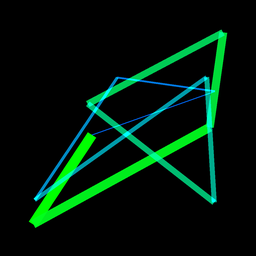
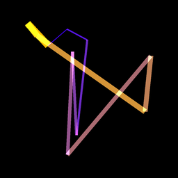

# Random Gradient Line Art Generator
 

This Python script generates random abstract line art images with a gradient color transition between two random colors. It uses the Python Imaging Library (PIL) to draw lines between randomly generated points on an image canvas. The color of each line smoothly transitions from a randomly chosen starting color to an ending color using a gradient effect.

## Features
- Creates 10 random images by default.
- Each image is 256x256 pixels in size, scaled from a larger canvas for finer resolution.
- Lines are drawn between random points, with each line having a color that transitions from a random start color to a random end color.
- Supports resizing using the high-quality `Image.Resampling.LANCZOS` method.
- Gradually increases the thickness of each line drawn between the points.

## Requirements
- Python 3.x
- The following Python packages:
  - `Pillow`

## Installation

1. Clone this repository or download the script.
2. Create a virtual environment (optional but recommended):
    ```bash
    python -m venv venv
    ```
3. Activate the virtual environment:
   - On Windows:
     ```bash
     venv\Scripts\activate
     ```
   - On macOS/Linux:
     ```bash
     source venv/bin/activate
     ```
4. Install the required dependencies:
    ```bash
    pip install Pillow
    ```

## Usage

To run the script and generate 10 random images, use the following command:

```bash
python gen_art.py
